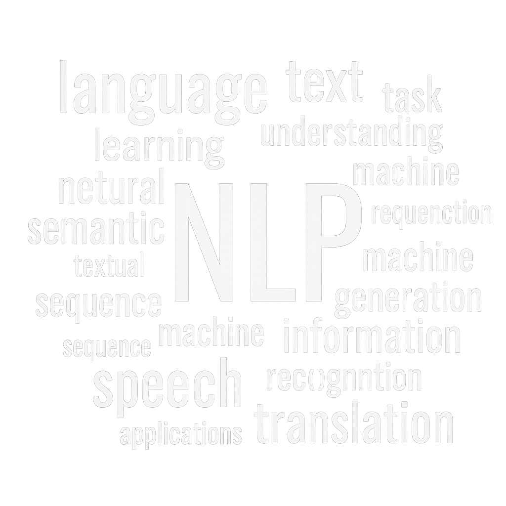

# Natural Language Processing (NLP)
<!-- .slide: data-background="#23272f" data-background-opacity="0.98" -->

---

## Introduction
<!-- .slide: data-background="#23272f" data-background-opacity="0.98" -->
Natural Language Processing (NLP) is a field at the intersection of computer science, artificial intelligence, and linguistics. It focuses on the interaction between computers and human (natural) languages.

---

## Key Concepts
<!-- .slide: data-background="#23272f" data-background-opacity="0.98" -->
- **Tokenization**: Splitting text into words or sentences
- **Part-of-Speech Tagging**: Identifying grammatical categories
- **Named Entity Recognition**: Detecting names, places, organizations
- **Parsing**: Analyzing grammatical structure

---

## Applications
<!-- .slide: data-background="#23272f" data-background-opacity="0.98" -->
- Machine Translation (e.g., Google Translate)
- Sentiment Analysis
- Chatbots & Virtual Assistants
- Text Summarization
- Speech Recognition

---

## Example: NLP in Action
<!-- .slide: data-background="#23272f" data-background-opacity="0.98" -->

---

## Vertical: Challenges in NLP
<!-- .slide: data-background="#23272f" data-background-opacity="0.98" -->

### Ambiguity
<!-- .slide: data-background="#23272f" data-background-opacity="0.98" -->
Words and sentences can have multiple meanings depending on context.

### Data & Bias
<!-- .slide: data-background="#23272f" data-background-opacity="0.98" -->
NLP models can inherit biases present in training data, leading to unfair or inaccurate results.

---

## Thank You!
<!-- .slide: data-background="#23272f" data-background-opacity="0.98" -->
- [Source Code](https://github.com/moutaouakkil/revealjs-presentation)
- [Learn More about NLP](https://en.wikipedia.org/wiki/Natural_language_processing) 